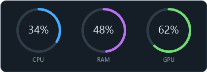
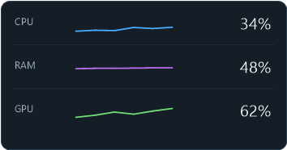
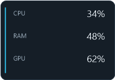
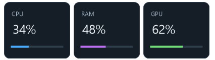

# SysMon

SysMon is a native Windows system monitoring application built in C++ using the Win32 API and GDI.

It provides real-time CPU, memory, disk, process, hardware, device, and system monitoring through a dark desktop dashboard. SysMon also includes a movable desktop widget and Windows system tray integration.

## Current Version

### v1.0.0

The v1.0 release adds parent-owned sensor cleanup, bounded shutdown, configurable overlays, pause/resume, reversible current-user startup entries, stricter settings, section resets, diagnostics and support reports. See [release notes](RELEASE-NOTES-v1.0.0.md) and [verification limits](V1.0-VERIFICATION.md) before publishing a final release.

Build the portable release with `package-release.ps1`. Its ZIP is `dist/SysMon-v1.0.0.zip`. Extract the entire archive and open its `SysMon.exe`; keep the sensor helper, logos folder, licenses and corresponding sources together. Download compiled packages from [GitHub Releases](https://github.com/Hadinouh/SysMon/releases); the source repository does not track the executable.

## v1.0 overlay previews

These previews are rendered by SysMon's overlay test with sample readings. Each
style supports independent CPU/RAM/GPU/Disk/Network selection, background on/off,
opacity, scale, always-on-top and remembered monitor position.

| Precision Rings | Telemetry Stack |
| --- | --- |
|  |  |
| Side Rail | Floating Tiles |
|  |  |

## License, privacy and security

Original SysMon code and documentation use the [MIT license](LICENSE).
Third-party components retain their own licenses. See the exact versions, source
URLs and included license texts in [third-party notices](THIRD-PARTY-NOTICES.txt).
LibreHardwareMonitor and the Blacktempel libraries use MPL-2.0; HidSharp uses
Apache-2.0; Mono.Posix and the Microsoft support libraries use MIT with applicable
upstream notices. The self-contained helper includes the .NET runtime and its
notices. Embedded PawnIO modules have separate LGPL-2.1 terms.

Each portable release includes the local LibreHardwareMonitor source and
corresponding upstream source archives. The application PNGs are documented as ChatGPT-generated for SysMon and distributed under MIT to the extent contributors hold applicable rights; see [asset notices](ASSET-NOTICES.md). Third-party program icons retain their own rights.

SysMon has no telemetry or automatic report uploads. Optional/manual update
checks contact GitHub. See [privacy](PRIVACY.md), [security reporting](SECURITY.md)
and the [final-release checklist](RELEASE-CHECKLIST.md).

The previous v0.9.0 release was a major monitoring and usability update. It adds multi-GPU monitoring, live network monitoring, hardware temperature sensors, a redesigned Processes experience, a complete Settings page, Windows utility tools, alerts and logging, update checking, startup integration, themes, and responsive/maximized layouts.

The temperature engine uses the bundled `SysMonSensors` helper based on LibreHardwareMonitor. The Windows release package can publish this helper self-contained so end users do not need to install the .NET runtime separately.

## Features

- Live CPU usage monitoring
- Live RAM usage monitoring
- Real-time physical disk monitoring
- Multiple disk detection
- Live CPU, memory, and disk graphs
- 60-second performance history
- CPU hardware and cache information
- Memory hardware information
- Memory commit, cache, and kernel pool statistics
- Disk active time
- Disk transfer rate
- Disk read and write speeds
- Disk response time
- Disk model and capacity information
- SSD, NVMe, SATA, and HDD identification
- System disk and page file detection
- System uptime tracking

- Real-time process monitoring
- Process CPU usage
- Process memory usage
- Process thread and handle counts
- Parent PID information
- Sortable process columns
- Process search and filtering
- Process row selection and hover states
- Process termination with confirmation
- Process-tree termination
- Protection for critical Windows processes and SysMon

- Detailed Windows operating system information
- Computer name and system architecture
- CPU model, cores, threads, socket, and cache information
- Installed memory, memory type, speed, slots, and form factor
- GPU model, VRAM, driver version, and driver date
- DirectX version detection
- Physical storage information
- Network adapter information
- IPv4 and IPv6 information
- System manufacturer and model
- Motherboard manufacturer and model
- BIOS vendor, version, and release date

- Connected device detection
- USB device detection
- Bluetooth device detection
- HID device detection
- Monitor and display detection
- Audio device detection
- Camera, printer, keyboard, and mouse detection
- Selectable connected devices
- Device manufacturer information
- Device class information
- Device status information
- Device connection type
- Device instance ID
- Hardware ID
- USB VID and PID information
- Physical device location information
- Automatic device refresh when hardware changes

- Scrollable System Info page
- Dark native Windows interface
- Desktop CPU/RAM widget
- Draggable desktop widget
- Persistent widget position
- Persistent widget ON/OFF setting
- Windows system tray support
- Double-click tray icon to restore SysMon
- Right-click tray menu
- Double-buffered rendering
- Native Win32 API and GDI
- No external GUI framework required

## Performance

The Performance page currently provides detailed monitoring for:

### CPU

- Live CPU utilization
- 60-second usage history
- Current speed
- Base speed
- Process count
- Thread count
- Handle count
- System uptime
- Socket count
- Core count
- Logical processor count
- Virtualization status
- L1, L2, and L3 cache information

### Memory

- Live memory utilization
- 60-second memory history
- Installed and usable memory
- In-use memory
- Available memory
- Committed memory
- Cached memory
- Paged pool
- Non-paged pool
- Memory speed
- Memory slots used
- Memory form factor
- Hardware-reserved memory

### Disk

- Automatic physical disk detection
- Support for multiple installed disks
- Selectable disk cards
- Live active-time history
- Live disk-transfer-rate history
- Average response time
- Read speed
- Write speed
- Disk model
- Capacity
- Formatted capacity
- System disk detection
- Page file detection
- Storage type detection

### GPU

- Multi-GPU detection and selection
- Live GPU utilization history
- Dedicated and shared GPU memory usage
- GPU temperature and fan telemetry when supported
- GPU clocks, power, encode/decode activity, driver and bus information
- GPU-related process statistics

### Network

- Multiple network-adapter detection and selection
- Live download and upload history
- Current transfer rates and link speed
- Total sent/received data and packet statistics
- IPv4, IPv6, MAC, gateway, DNS, subnet, and connection information
- Wi-Fi SSID, standard, and signal quality when available

### Temperatures

- CPU package/core temperatures when supported
- GPU temperature monitoring
- Motherboard/firmware sensor monitoring
- Temperature history
- CPU package power and clock telemetry when available
- Hardware readings provided through the `SysMonSensors` helper

## Processes

SysMon includes a real-time Processes page for inspecting running Windows processes.

Processes can be sorted by:

- Name
- CPU usage
- Memory usage
- Thread count
- PID

The page also includes search and filtering, process selection, Parent PID information, handle counts, and process termination.

Protected processes such as System Idle Process, System, and SysMon itself cannot be terminated through the application.

## System Info

SysMon v0.8 introduces a detailed System Info / About PC page.

### Operating System

- Windows edition
- Windows version
- Installation date
- OS build
- Windows Feature Experience Pack information
- System architecture
- Computer name

### Processor

- CPU model
- Physical core count
- Logical processor count
- Base speed
- Current reported speed
- CPU socket
- Virtualization status
- L1 cache
- L2 cache
- L3 cache

### Memory

- Installed memory
- Memory type
- Memory speed
- Slots used
- Memory form factor

### Graphics

- GPU model
- Video memory
- Driver version
- Driver date
- DirectX version

### Storage

SysMon lists detected physical storage devices and displays:

- Disk number
- Drive letters
- Disk model
- Capacity
- SSD / HDD identification
- NVMe / SATA / USB storage type

### Network

- Active network adapter
- Connection type
- IPv4 address
- IPv6 address

### System and Motherboard

- System manufacturer
- System model
- Motherboard manufacturer
- Motherboard model

### BIOS / Firmware

- BIOS vendor
- BIOS version
- BIOS release date

## Connected Devices

SysMon can enumerate currently present Windows Plug and Play devices.

Supported device categories include:

- USB
- Bluetooth
- HID
- Audio devices
- Monitors
- Cameras
- Printers
- Keyboards
- Mice
- Other user-facing Plug and Play devices

Devices can be selected to display additional information including:

- Device name
- Connection type
- Device class
- Manufacturer
- Device status
- Problem code when available
- Physical device location
- Vendor ID
- Product ID
- Device instance ID
- Hardware ID

The connected-device list automatically refreshes when Windows reports hardware changes.

## Desktop Widget

When SysMon is minimized, it can move to the Windows system tray and display a small desktop widget.

The widget displays live CPU and RAM usage with progress bars.

The widget can be dragged anywhere on the desktop. Its position and enabled state are stored in `SysMon.ini` and restored the next time SysMon starts.

## Settings

SysMon v0.9.0 adds a complete Settings page with startup behavior, tray behavior, update checks, monitoring intervals, temperature/network units, dark/light/Windows-following themes, accent colors, transparency, compact mode, quick tab previews, font sizing, alerts, logging, desktop notifications, the desktop overlay, settings backup/restore, and support tools.

## Tools

The Tools page provides shortcuts and actions for common Windows maintenance and diagnostic utilities, including Disk Cleanup, System File Checker, Startup Manager, Event Viewer, System Configuration, Services, elevated Command Prompt, drive optimization, Windows Update, Power Options, System Restore, network settings, temporary-file cleanup, DNS flushing, Recycle Bin cleanup, and system snapshots.

## Building

Requirements for the native application:

- Windows
- MSYS2 UCRT64 / MinGW-w64 `g++` and `windres`
- C++17 support
- .NET 10 SDK for the sensor helper
- Internet access for NuGet restore and corresponding-source downloads

Build the application from PowerShell:

```powershell
powershell -ExecutionPolicy Bypass -File .\build.ps1
```

To create a complete Windows x64 release ZIP, including a self-contained `SysMonSensors` helper:

```powershell
powershell -ExecutionPolicy Bypass -File .\package-release.ps1
```

The finished archive is written to `dist/`. Add `-RunTests` to run the native
verification suite. Release publishing disables managed debug information and
rejects PDB files, local user/build paths in binaries, and unreviewed dependency
versions. `DEPENDENCIES.json` and `SHA256SUMS.txt` record the packaged components
and hashes. A .NET runtime install is not required for the default self-contained
Windows x64 package. `-FrameworkDependentSensors` requires a compatible installed
.NET 10 runtime instead. Builds remain unsigned until a trusted signing service
or certificate is configured.

## Version History

### v1.0.0

- Reliable shutdown, sensor-process cleanup and duplicate-instance prevention.
- Four redesigned overlays with optional backgrounds and monitor-position memory.
- Pause/resume and expanded tray actions; reversible current-user Startup Manager.
- Validated settings, reset controls, improved dropdowns and DPI/resizing fixes.
- Working Network and GPU process detail windows from View All.
- Sensor status, diagnostic logging, support reports and improved update details.
- Embedded application logo and Windows executable version metadata.
- MIT license, expanded dependency notices, privacy/security documents, source
  bundles and release checks for debug symbols and local build paths.
- Final signing and physical multi-monitor checks remain on
  the release checklist.

### v0.9.0

- Added multi-GPU performance monitoring and GPU selection
- Added live network performance monitoring and adapter selection
- Added hardware temperature monitoring through SysMonSensors / LibreHardwareMonitor
- Added and polished the dedicated Temperatures page
- Expanded dashboard hardware statistics
- Overhauled the Processes page with filtering, grouping, metadata, actions, and priority controls
- Added background process sampling and process metadata caching
- Added the complete Settings page
- Added dark, light, and Follow Windows themes, accent colors, transparency, compact mode, quick tab previews, and font sizing
- Added configurable monitoring interval, temperature units, and network units
- Added CPU/GPU temperature, disk usage, and memory usage alerts
- Added desktop notifications, alert sounds, alert logging, and monitoring-data logging
- Added configurable log retention and the SysMon data folder
- Added settings export, import, and reset controls
- Added startup integration through Windows Task Scheduler
- Added optional GitHub release update checking
- Added desktop overlay settings and the Ctrl+Alt+O overlay hotkey
- Added the Tools page with Windows maintenance and diagnostic shortcuts
- Expanded System Info and connected-device details
- Added responsive resizing and improved maximized/full-screen layouts
- Added responsive hitboxes, scrolling, and quick navigation previews
- Improved minimize-to-tray, restore, and tray-icon recovery behavior
- Improved desktop widget behavior and persisted positioning
- Added background-sampling and rendering-performance improvements
- Added build automation, release packaging, application manifest, and Windows version metadata

### v0.8.0

- Added the System Info / About PC page
- Added detailed Windows operating system information
- Added computer name and system architecture information
- Added detailed CPU information
- Added CPU core, thread, socket, virtualization, and cache information
- Added installed memory information
- Added memory type, speed, slot, and form-factor information
- Added GPU model and VRAM information
- Added GPU driver version and driver date
- Added DirectX version detection
- Added physical storage information to System Info
- Added network adapter information
- Added IPv4 and IPv6 information
- Added system manufacturer and model information
- Added motherboard manufacturer and model information
- Added BIOS vendor, version, and release date
- Added connected Plug and Play device detection
- Added USB, Bluetooth, HID, display, audio, camera, printer, keyboard, and mouse detection
- Added selectable connected devices
- Added detailed device information
- Added device manufacturer and class information
- Added device status and problem-code information
- Added device instance ID and hardware ID
- Added USB VID/PID detection
- Added physical device location information
- Added automatic device refresh on Windows hardware changes
- Added scrolling support to the System Info page

### v0.7.0

- Redesigned the Performance page
- Added detailed CPU monitoring
- Added CPU hardware, topology, virtualization, and cache information
- Added detailed memory monitoring
- Added memory commit, cache, paged pool, and non-paged pool information
- Added memory speed, slot, form-factor, and hardware-reserved information
- Added real physical disk activity monitoring
- Added live disk active-time graphs
- Added live disk transfer-rate graphs
- Added read speed, write speed, and response time
- Added physical disk model and capacity information
- Added SSD, HDD, SATA, and NVMe identification
- Added automatic multiple-disk detection
- Added selectable disk cards
- Added system-disk and page-file detection
- Removed obsolete Performance page scrolling

### v0.6

- Added advanced process monitoring
- Added sortable PROCESS, CPU, MEMORY, THREADS, and PID columns
- Added ascending and descending sorting
- Added live process search and filtering
- Added a clear search button and focused search state
- Added process row hover and selection
- Added selected-process details including Parent PID and handle count
- Added live filtered process counts
- Added END TASK with confirmation
- Added process-tree termination for multi-process applications
- Added safeguards for System Idle Process, System, and SysMon itself

### v0.5

- Redesigned the main dashboard with a modern sidebar layout
- Added navigation for Dashboard, Processes, Performance, System Info, and Settings
- Added a real-time Processes page
- Added process CPU usage, memory usage, thread count, and PID
- Added System Idle Process support
- Added process list scrolling
- Added live process count
- Improved dashboard layout
- Combined uptime and desktop widget controls into a cleaner summary card

### v0.4

- Added CPU usage history
- Added RAM usage history
- Added 120-sample history buffers
- Added 500 ms performance sampling
- Added smooth Bezier graph rendering
- Added 60-second graph timelines
- Added graph grid lines
- Added filled graph areas
- Added double-buffered dashboard rendering

### v0.3

- Added persistent settings
- Added persistent desktop widget position
- Added persistent widget ON/OFF state
- Split the original single-file application into dedicated modules
- Added separate statistics, settings, tray, widget, and UI modules
